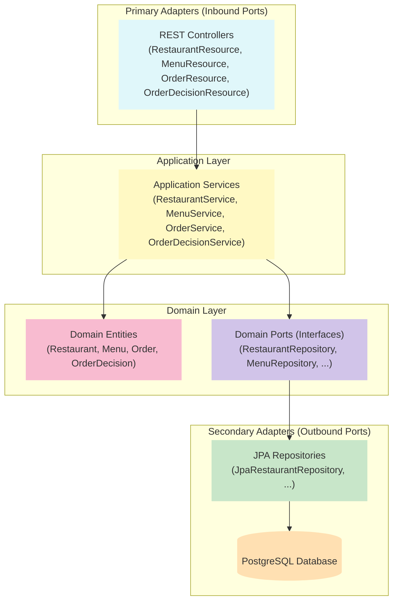

# JHipster Sample Application

## Prerequisites

### Java

You need to have Java 21:

- [JDK 21](https://openjdk.java.net/projects/jdk/21/)

### Node.js and NPM

Before you can build this project, you must install and configure the following dependencies on your machine:

[Node.js](https://nodejs.org/): We use Node to run a development web server and build the project.
Depending on your system, you can install Node either from source or as a pre-packaged bundle.

After installing Node, you should be able to run the following command to install development tools.
You will only need to run this command when dependencies change in [package.json](package.json).

```
npm install
```

## Local environment

- [Local server](http://localhost:8080)
- [Local API doc](http://localhost:8080/swagger-ui.html)

<!-- jhipster-needle-localEnvironment -->

## Start up

```bash
./mvnw
```

```bash
docker compose -f src/main/docker/postgresql.yml up -d
```

<!-- jhipster-needle-startupCommand -->

## Documentation

- [Package types](documentation/package-types.md)
- [Assertions](documentation/assertions.md)
- [PostgreSQL](documentation/postgresql.md)
- [Logs Spy](documentation/logs-spy.md)
- [CORS configuration](documentation/cors-configuration.md)
- [Cucumber](documentation/cucumber.md)
- [Cucumber authentication](documentation/cucumber-authentication.md)
- [JWT basic auth](documentation/jwt-basic-auth.md)

<!-- jhipster-needle-documentation -->

## Backend Architecture

This project uses a **hexagonal (ports and adapters) architecture** for the backend, ensuring separation of concerns, testability, and scalability.



### Key Layers

- **Primary Adapters:** REST controllers expose API endpoints.
- **Application Layer:** Services handle business logic and validation.
- **Domain Layer:** Entities and repository interfaces (ports) define the core model and contracts.
- **Secondary Adapters:** JPA repositories implement the ports and persist to PostgreSQL.

## API Documentation

- **Swagger UI:** [http://localhost:8080/swagger-ui.html](http://localhost:8080/swagger-ui.html)
- **OpenAPI JSON:** [http://localhost:8080/v3/api-docs](http://localhost:8080/v3/api-docs)

The API is secured with JWT. Use the "Authorize" button in Swagger UI to authenticate.
